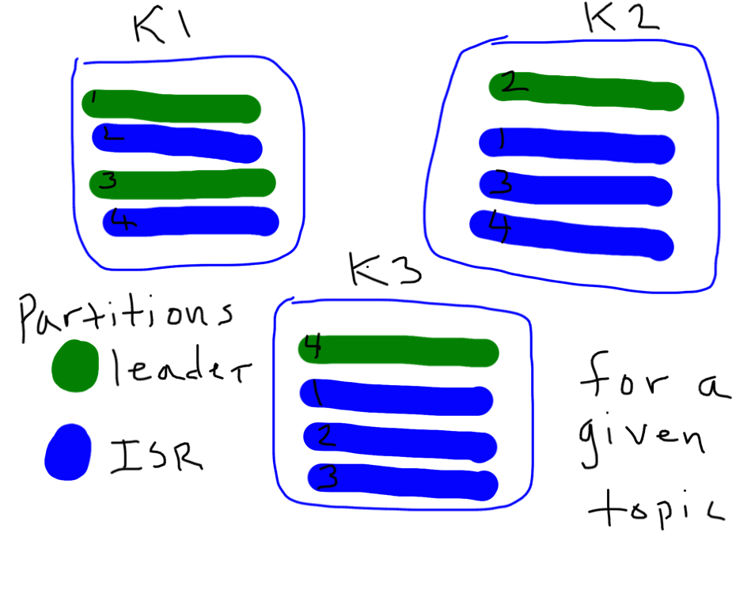
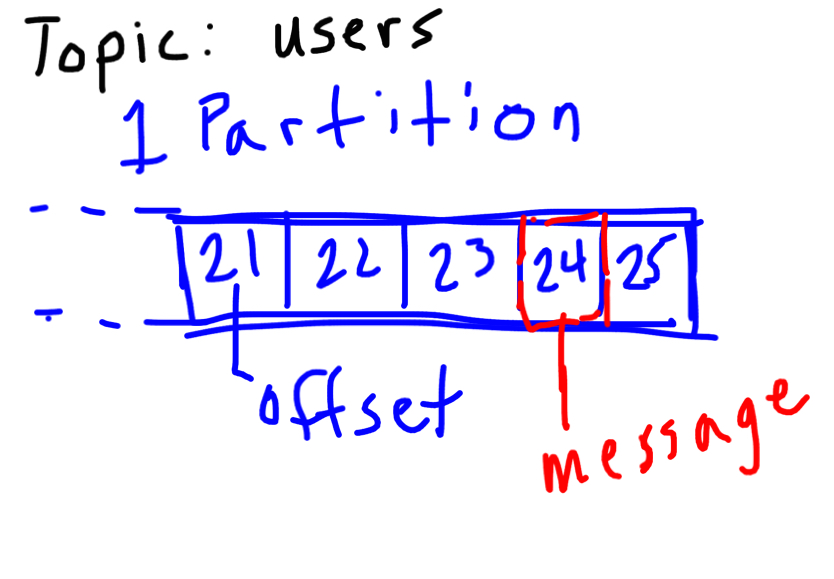
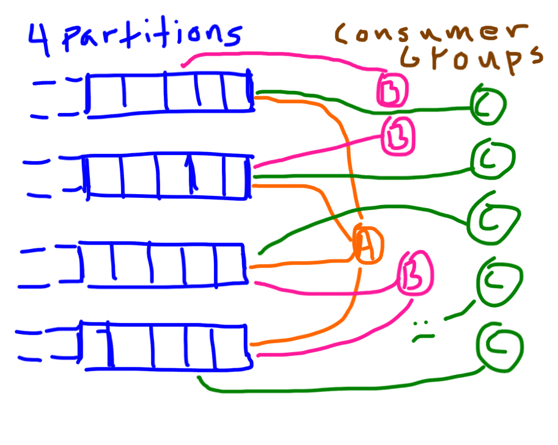

:css: css/presentation.css
:skip-help: true
:data-transition-duration: 2000

.. title:: Kafka in a Flash

Kafka in a Flash
================

----

What Is Kafka
=============

* A distributed message broker
* Created at LinkedIn
* Open sourced early 2011
* Top level apache project October 2012

----

Why Another Broker
==================

* Current brokers didn't meet the needs of LinkedIn
* High throughput
* Very low latency
* Hardware sympathetic

----

How It Works
============

----

Broker Topology
===============

 * Manually set where partitions live in cluster
 * Manually set where replicants reside
 * Each partition has a leader
 * ISR, in-sync-replica
 * Failover to an ISR

----

...Broker Topology
==================

----

Topics & Partitions
===================

 * One topic can have many partitions
 * Paritions determine parallelism per consumer group
 * Hard/Impossible to remove partitions, Hard to add
 * Data deletion based on broker or topic settings

----

...Topics & Partitions
======================

----

Consumers
=========

----

Simple Consumer
===============

 * Read from a single partition
 * Manually track offsets
 * Manually handle partition offset changes
 * Access to low level protocol messages

----

High Level Consumer
===================

 * Handles consumer groups
 * Leader election for consumers within a group
 * Partition leadership changes
 * Offset tracking

----

...High Level Consumer
=================================

----

Differences from the Rest
=========================

 * Ordered partitions
 * Simple data structures
 * Append only
 * Pull based only
 * Replication works
 * Scalable, high throughput, low latency

----

Questions
=========

